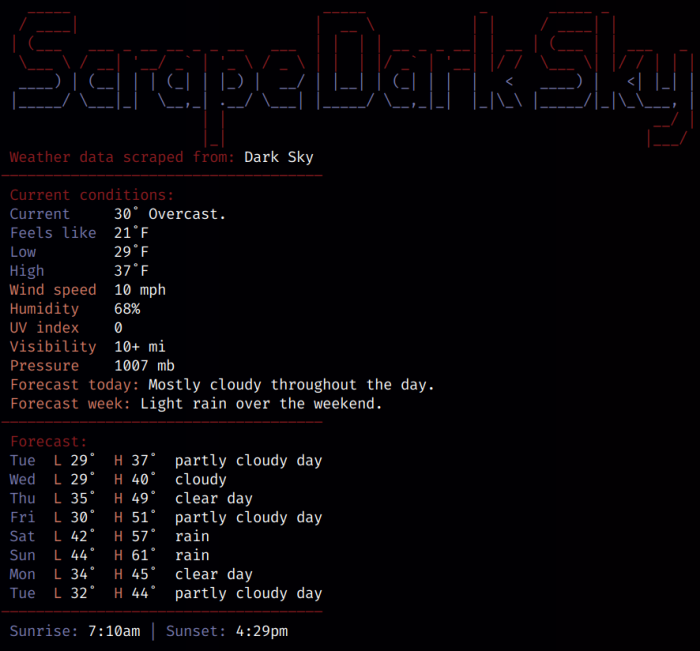

# scrape_dark_sky_nick3499

## Darksky API will no longer be available after December 31st 2022.

Scrape weather data: Python, BeautifulSoup, requests, datetime, dateutil.relativedelta



## Shebang Line

```shell
#!/usr/bin/env python
```

Unix reads that human-readable `#!` (shebang) as a [magic number](https://en.wikipedia.org/wiki/Shebang_(Unix)#Magic_number) which instantiantes the executable text file (`app.py`) as a Python application.

```python
>>> hex(ord('#'))
'0x23'
>>> hex(ord('!'))
'0x21'
```

Through the _eyes_ of Unix, the shebang looks something like `0x23 0x21`. In the _mind_ of Unix, the following characters are recognized as the path of Python interpreter (or symlink). In other words, `app.py` can by started by entering the following in the CLI of a Unix-like terminal emulator:

```shell
$ ./app.py
```

## Module Documentation

```
'''Scrape weather data from Dark Sky for personal/non-commercial use. Review DarkSky's TOS darksky.net/tos'''
```

```
>>> __doc__
"Scrape weather data from Dark Sky for personal/non-commercial use.\nReview DarkSky's TOS darksky.net/tos"
```

The module documentation is stored in the `__doc__` string.

## Import Modules

```python
from datetime import datetime
from datetime import timedelta
from bs4 import BeautifulSoup
from requests import get
from figlet import get_figlet
```

A Python virtual environment should be used to develop and run the app in order to avoid changing Python system modules. For example, a new module could change the version of a system module.

The `requirements.txt` file lists the modules along with their specific versions, but the latest versions should work also.

## Figlet

```python
print(get_figlet())
```

```python
figlet = '''\x1b[38;2;140;28;32m
   _____                             _____             _       _____ _
  / ____|                           |  __ \           | |     / ____| |
 | (___   ___ _ __ __ _ _ __   ___  | |  | | __ _ _ __| | __ | (___ | | ___   _
  \___ \ / __| '__/ _` | '_ \ / _ \ | |  | |/ _` | '__| |/ /  \___ \| |/ / | | |\x1b[38;2;119;121;174m
  ____) | (__| | | (_| | |_) |  __/ | |__| | (_| | |  |   <   ____) |   <| |_| |
 |_____/ \___|_|  \__,_| .__/ \___| |_____/ \__,_|_|  |_|\_\ |_____/|_|\_\___, |\x1b[38;2;140;28;32m
                       | |                                                 __/ |
                       |_|                                                |___/\x1b[0m'''
```

The `get_figlet()` method comes from the `figlet` module. And the `figlet` module keeps the ASCII art separate from the scraper code in `app.py`.

ref. [figlet.org examples](http://www.figlet.org/examples.html).

The `\x1b[38;2;140;28;32m` string sets RGB color values.

## Request Data

```python
REQ = get('https://darksky.net/forecast/40.9322,-73.899/us12/en')
```

The `requests.get()` method gets the HTML data from [Dark Sky](https://darksky.net/).

## Parse Tree

```python
SOUP = BeautifulSoup(REQ.text, 'html5lib')
```

The instruction above instantiates [BeautifulSoup](https://www.crummy.com/software/BeautifulSoup/bs4/doc/#quick-start). `REQ.text` is the requested HTML markup code and `'html5lib'` is a Python HTML parsing module.

## 3-Color Theme

```python
THEME = {
    'c1': '\x1b[38;2;140;28;32m',
    'c2': '\x1b[38;2;119;121;174m',
    'c3': '\x1b[38;2;213;122;100m',
    'rset': '\x1b[0m'}  # 3-color theme; `rset` resets color to default
```

The escaped strings above are for string-formatting, and they establish a 3-color theme. For example, `'{THEME['c2']}{s1[0]:<12}{THEME['rset']}'` sets the color of the `'Current'` string.

## Titles

```python
PG_TITLE = SOUP.title.string.strip()
```

`SOUP.title.string` gets the string from the `title` tag, and the `strip()` method removes whitespace and newline sequences `\n`.

```python
print(f" {THEME['c1']}Weather data scraped from:{THEME['rset']} {PG_TITLE}")
print(f"{THEME['c1']}―――――――――――――――――――――――――――――――――――――{THEME['rset']}")
print(f" {THEME['c1']}Current conditions:{THEME['rset']}")  # subtitles
```

```python
print(f" {THEME['c1']}Forecast:{THEME['rset']}")  # weekly forecast; temps/conditions
```

Subtitles are used to label sections. In this case, there is a `Current conditions` section followed by a `Forecast` section.

## Current Conditions

```python
CURR_COND_STR_1 = [
    ['Current', 'summary swap', ''],
    ['Feels like', 'feels-like-text', 'F'],
    ['Low', 'low-temp-text', 'F'],
    ['High', 'high-temp-text', 'F']]

for s1 in CURR_COND_STR_1:
    print(f" {THEME['c2']}{s1[0]:<12}{THEME['rset']}\
{SOUP.find('span', {'class': s1[1]}).string}{s1[2]}")
```

`CURR_COND_STR_1` is assigned a list of nested lists which contain label strings, class value strings along with any extra strings. A `for` loop iterates over `CURR_COND_STR_1` to print the current weather data. The same is done with `CURR_COND_STR_2`.

```python
FORECAST_TODAY = SOUP.find(
    'span', {'class': 'currently__summary next swap'}).string.strip()
FORECAST_WEEK = SOUP.find('div', {'id': 'week'}).contents[1].contents[0].strip()
print(f" {THEME['c3']}Forecast today:{THEME['rset']} {FORECAST_TODAY}")
print(f" {THEME['c3']}Forecast week:{THEME['rset']} {FORECAST_WEEK}")
```

Finally, two lines are printed for today's and this weeks forecast.

## Forecast

```python
for i in range(0, 8):
    min_temp = SOUP.find('a', {'data-day': str(i)}).contents[3].contents[1].string
    max_temp = SOUP.find('a', {'data-day': str(i)}).contents[3].contents[5].string
    weekday_str = (datetime.now() + timedelta(days=i)).strftime('%a')
    wthr_day = SOUP.find(
        'a', {'data-day': str(i)}).contents[1].find(
            'span', {'class': 'skycon'}).img['alt'].split(' ')[0].replace(
                '-', ' ')  # condition
    print(f" {THEME['c2']}{weekday_str:<5}{THEME['rset']}{THEME['c3']}{'L':<2}\
{THEME['rset']}{min_temp:<5}{THEME['c3']}{'H':<2}{THEME['rset']}{max_temp:<5}\
{wthr_day}")  # print temps/conditions
```

The `for` loop above is used to print 8 lines of forecast temps along with general forecast descriptions (based on img alt text).

```python
SOUP.find('a', {'data-day': str(i)}).contents[3].contents[1].string
```

The instruction above navigates through tags with `data-day` class to get the minor temp string, e.g. `'42°'`.

```python
(datetime.now() + timedelta(days=i)).strftime('%a')
```

Within its looping structure, `(datetime.now() + timedelta(days=i)).strftime('%a')` iteratively advances the abbreviated weekday by one day with each iteration, e.g. `Mon`, `Tue`, `Wed`, etc.

```python
SOUP.find('a', {'data-day': str(i)}).contents[1].find('span', {'class': 'skycon'}).img['alt'].split(' ')[0].replace('-', ' ')
```

The instruction above helps illustrate the parsing gymnastics required to hunt down the `alt` parameter of an `img` tag and format it and stored in `wthr_day` (see below).

```python
print(f" {THEME['c2']}{day_str:<5}{THEME['rset']}{THEME['c3']}{'L':<2}{THEME['rset']}{min_temp:<5}{THEME['c3']}{'H':<2}{THEME['rset']}{max_temp:<5}{wthr_day}")
```

The instruction above prints the low/high temps along with the `wthr_day` variable manipulated from the `img` tag.

## Sunrise/Sunset Times

```python
SUNRISE_TIME = SOUP.find('span', {'class':'sunrise swip'}).contents[3].string
SUNSET_TIME = SOUP.find('span', {'class':'sunset swap'}).contents[3].string
print(f" {THEME['c2']}Sunrise:{THEME['rset']} {SUNRISE_TIME}{THEME['c2']} | Sunset:{THEME['rset']} {SUNSET_TIME}")
```

Finally, the sunrise/sunset times are printed.

```python
SOUP.find('span', {'class':'sunrise swip'}).contents[3].string
```

`SOUP.find('span', {'class':'sunrise swip'})` gets the specific `span` tag with `sunrise swip` class, then `contents[3]` navigates to the time string.
